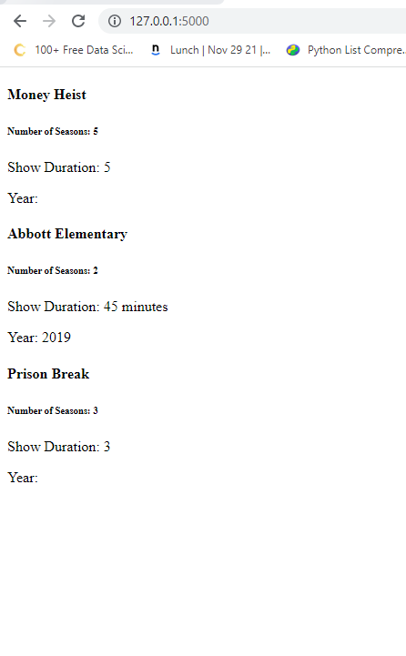
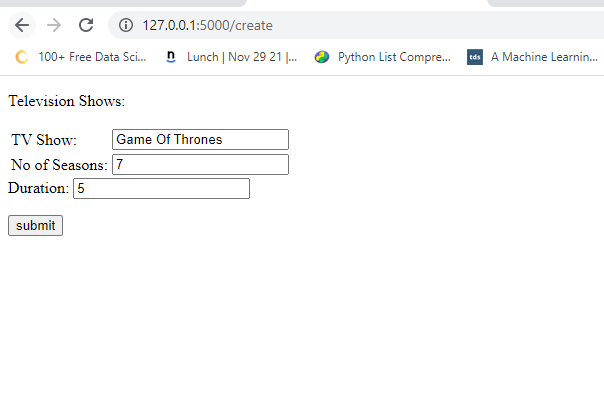
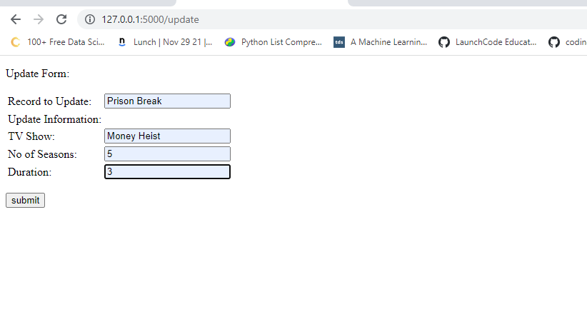
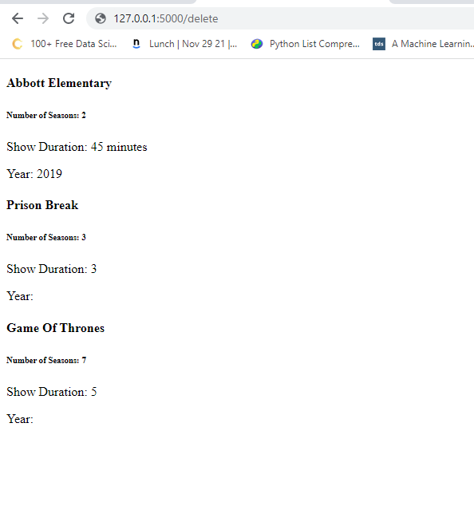

* Please see mongo pyfile to see code. I have attached screenshots below for updating, creating, deleting documents in Mongo DB

### All file

### Using create endpoint

### After created file

### Using Update endpoint

### Using delete endpoint

